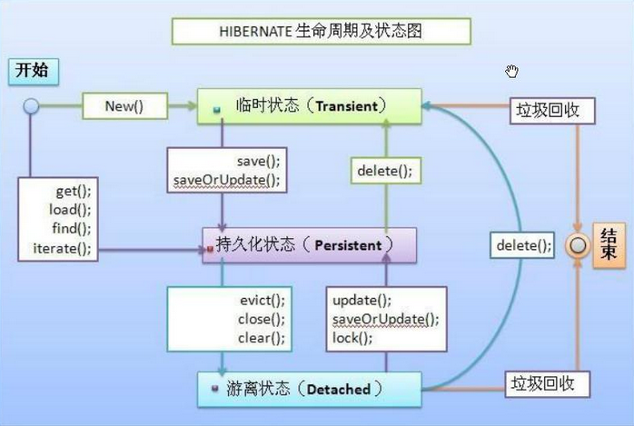

# Readme  
### 知识点  
1. 什么是持久化？为什么要持久化？  
将数据从内存中数据持久化到储存介质中（文件，数据库）  
需要永久保存数据。
2. hibernate和jdbc的区别？hibernate的优势是什么？  
    * jdbc是用来实现数据库操作，hibernate对jdbc进行轻量级的封装。  
    hibernate通过配置映射关系（xml，注解），然后通过hibernate提供api方法操作。  
    * 优势：开源，通过javabean封装实现持久化，对jdbc的轻量封装，相对于jdbc操作更方便。  
3. ORM是什么  
    * ORM：Object Relational Mapping（对象关系映射）  
    * 通过持久化对象上执行增删改查操作。
4. 搭载hibernate环境步骤  
    1. 导包  
    2. 创建hibernate主体配置文件：hibernate.cfg.xml  
        a. 数据库配置：数据库版本、4个配置  
        b. 配置映射文件  
        
   3. 创建JavaBean和对应的映射文件：JavaBean.hbm.xml  
   4. 写测试类执行持久化操作  
   ```
   //读取配置文件：hibernate.cfg.xml
   Configuration cfg = new Configuration().configure();
   ServiceRegistry sr = new ServiceRegistryBuilder().applySettings(cfg.getProperties()).buildServiceRegistry();
   
   //获取会话工厂：SessionFactory
   SessionFactory sf = cfg.buildSessionFactory(sr);
   
   //打开会话：Session
   Session session = sf.openSession();
   
   //执行增删改查
   //增删改需要开启事务
   session.save();
   session.update();
   session.delete();
   //查不需要开启事务
   //根据OID查询
   session.get(Class clazz, Serizlized id);
   session.get(String args0, Serizlized id);
   
   //关闭会话55
   session.close();
   ```
   
5. get()和load()区别
    * get：立即加载，load：延迟加载
    * get： 如果纪律在数据库不存在返回null，load：认为记录在数据库一定存在，如果不存在抛出异常
6. hibernate的实体对象的三种状态？如何切换？
    * 瞬时状态：通过new关键创建的对象，所以在数据库中不存在的数据。
    * 持久化状态：在session中存在同时在数据库也存在的数据。
    * 游离状态：在session中不存在，在数据库存在的数据。
    