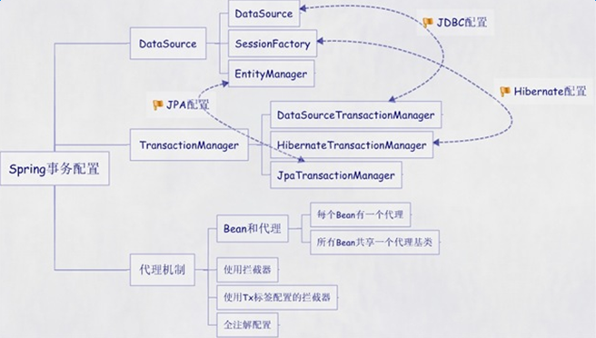

# Readme
### IOC(Inversion of Control)/DI(Dependence Injection)
控制反转/依赖注入  
由spring控制对象的生命周期和对象之间的关系  
spring工作方式：所有类在spring容器登记，告诉spring你是什么，需要什么。
spring在系统运行到适当时候，把你需要的东西给你，同时把你交给其他需要你的东西。
所有类的创建，销毁都由spring来控制

### AOP(Aspect Oriented Programming)
面向切面编程  
将对象看成一个空心圆柱体，其中封装了属性和方法。
面向切面编程就是把圆柱体以切面的形式剖开，选择性的提供业务逻辑，然后将剖开的切面复原  
技术分两类：  
* 动态代理技术：利用栏截消息的方式，对消息进行装饰，以取代原有对象的行为
* 静态织入技术：引入特定的语法创建“方面”，从而使得编译器可以在编译期间织入有关“方面”的代码。

相关术语
* 通知： 通知定义了切面是什么以及何时使用的概念。Spring 切面可以应用5种类型的通知：
    * 前置通知（Before）：在目标方法被调用之前调用通知功能。
    * 后置通知（After）：在目标方法完成之后调用通知，此时不会关心方法的输出是什么。
    * 返回通知（After-returning）：在目标方法成功执行之后调用通知。
    * 异常通知（After-throwing）：在目标方法抛出异常后调用通知。
    * 环绕通知（Around）：通知包裹了被通知的方法，在被通知的方法调用之前和调用之后执行自定义的行为。
* 连接点：是在应用执行过程中能够插入切面的一个点。
* 切点： 切点定义了切面在何处要织入的一个或者多个连接点。
* 切面：是通知和切点的结合。通知和切点共同定义了切面的全部内容。
* 引入：引入允许我们向现有类添加新方法或属性。
* 织入：是把切面应用到目标对象，并创建新的代理对象的过程。切面在指定的连接点被织入到目标对象中。

filter的实现和struts2的拦截器都是aop的思想

#### 预习
ssh(struts2+spring+hibernate)整合  
spring+hibernate  
1. 数据源有几种  
  
    * Spring自带数据源DriverManagerDataSource
    * DBCP数据源(Apache)
    * C3P0数据源：开放源代码的JDBC数据源实现项目
    * JNDI：如果应用配置在高性能的应用服务器（如WebLogic或Websphere,tomcat等）上，
    我们可能更希望使用应用服务器本身提供的数据源。
    * [相关jar包](http://www.java2s.com/Code/Jar/c/Catalogc.htm)
2. spring配置事务管理器  
spring事务配置的五种方式：每个Bean都有一个代理、所有Bean共享一个代理基类、使用拦截器、使用tx标签配置的拦截器、全注解(@Transactional)
    
    步骤：
    1. 创建一个Spring的事务管理器
    2. 设置那些方法需要事务管理及权限
    3. 关联事务管理器和执行的类(添加横切面)  
    

    ```
        <!-- 
            配置一个事物管理器
            bean:只是为了对类的初始化：相当于new了一个类 
        -->
        <bean id="transactionManager" 
            class="org.springframework.orm.hibernate5.HibernateTransactionManager"/>
        <!-- 
            制定哪些方法需要开启事物(是事物管理)	
            name="需要执行事物管理器的方法名"
            propagetion:必须的
            rollback-for：定义出现什么异常之后rollback
         -->
        <tx:advice transaction-manager="transactionManager" id="txAdvice">
            <tx:attributes>						
                <tx:method name="save*" propagation="REQUIRED" rollback-for="Exception"/>
                <tx:method name="update*" propagation="REQUIRED" rollback-for="Exception"/>
                <tx:method name="delete*" propagation="REQUIRED" rollback-for="Exception"/>
                <!--其他方法只读  -->
                <tx:method name="*" read-only="true"/>
            </tx:attributes>
        </tx:advice>
        <aop:config>
            <!--  定义哪些类调用那个处理器  -->
            <aop:pointcut expression="execution(* com.bjsxt.lc.service.impl.*.*(..))" id="pointcut"/>
            <!--  将事物管理器和横切面关联 -->
            <aop:advisor advice-ref="txAdvice" pointcut-ref="pointcut"/>
        </aop:config>
    ```
spring+struts2  
1. 在action中注入service
2. action的实例化

#### 附录QA
分析：为什么bean的id是dataSource
如果将数据源交给spring来管理，在执行时会报错，提示一个dataSource这个类找不到，需要用到Spring的自动装配来new出这个类，以提供给Spring来接管数据源  

Spring如何将hibernate的其他配置文件交给Spring来管理  
1. 开启Spring的 hibernate的支持
2. 将hibernate的配置文件信息放到Spring中
3. 将hibernate的映射文件配置到Spring文件中

[SSH搭建流程以及实现增删查改](https://blog.csdn.net/tian_xin_ke/article/details/62057006)
[SSH三大框架的整合](https://www.cnblogs.com/tuhooo/p/6491906.html)
