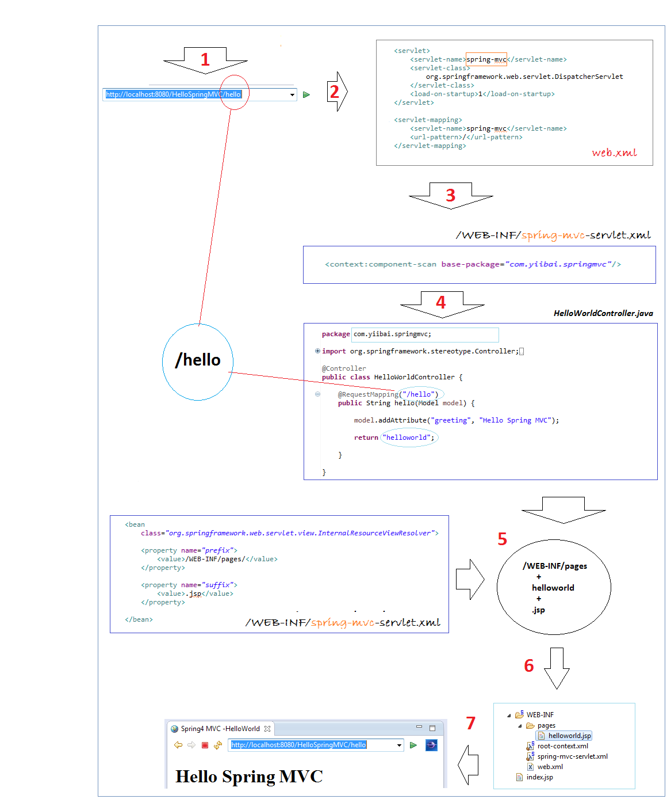

## Day0726
### springmvc的环境搭建
1. 导包
2. 配置web.xml
  ```
  spring5官方文档配置
  <web-app>
    <!-- spring配置 -->
    <!-- 配置ContextLoaderListener用于读取其他配置文件 -->
    <listener>
        <listener-class>org.springframework.web.context.ContextLoaderListener</listener-class>
    </listener>

    <context-param>
        <param-name>contextConfigLocation</param-name>
        <param-value>/WEB-INF/app-context.xml</param-value>
    </context-param>

    <!-- springMvc配置 -->
    <!-- 注册DispatcherServlet -->
    <servlet>
    <!-- 
    DispatcherServlet 读取 xml 配置文件的原则
    {servlet-name} ==> /WEB-INF/{servlet-name}-servlet.xml 
    -->
        <servlet-name>app</servlet-name>
        <servlet-class>org.springframework.web.servlet.DispatcherServlet</servlet-class>
        <init-param>
            <param-name>contextConfigLocation</param-name>
            <param-value></param-value>
        </init-param>
        <load-on-startup>1</load-on-startup>
    </servlet>

    <servlet-mapping>
        <servlet-name>app</servlet-name>
        <url-pattern>/app/*</url-pattern>
    </servlet-mapping>

</web-app>

...
自定义配置
<servlet>
   <servlet-name>my-dispatcher-name</servlet-name>
   <servlet-class>org.springframework.web.servlet.DispatcherServlet</servlet-class>
   <init-param>
       <!-- override default name {servlet-name}-servlet.xml -->
       <param-name>contextConfigLocation</param-name>
       <param-value>/WEB-INF/springmvc-myconfig.xml</param-value>
   </init-param>
   <load-on-startup>1</load-on-startup>
</servlet>
  ```
3. src下配置springmvc-servlet.xml文件
  ```
  <?xml version="1.0"encoding="UTF-8"?>
    <beans xmlns="http://www.springframework.org/schema/beans"
        xmlns:xsi="http://www.w3.org/2001/XMLSchema-instance"
        xmlns:p="http://www.springframework.org/schema/p"
        xmlns:context="http://www.springframework.org/schema/context"
        xmlns:mvc="http://www.springframework.org/schema/mvc"
        xsi:schemaLocation="http://www.springframework.org/schema/beans
        http://www.springframework.org/schema/beans/spring-beans-4.1.xsd 
        http://www.springframework.org/schema/context
        http://www.springframework.org/schema/context/spring-context-4.1.xsd 
        http://www.springframework.org/schema/mvc
        http://www.springframework.org/schema/mvc/spring-mvc-4.1.xsd">
    
    <context:component-scan base-package="com.yiibai.tutorial.springmvc"/>
        
    <context:annotation-config/>
        
    <!-- scan the package and the sub package 
    <context:component-scan base-package="test.SpringMVC"/>-->

    <!-- don't handle the static resource -->
    <mvc:default-servlet-handler />

    <!-- if you use annotation you must configure following setting -->
    <mvc:annotation-driven />

    <bean
        class="org.springframework.web.servlet.view.InternalResourceViewResolver">
        <!-- 前缀 -->
        <property name="prefix">
            <value>/WEB-INF/pages/</value>
        </property>
        <!-- 后缀 --> 
        <property name="suffix">
            <value>.jsp</value>
        </property>       
            
    </bean>
  </beans>
  ```
4. 编写action文件
   ```
   //请求地址
   @RequestMapping("/person1")
    //参数为返回值，自动匹配参数，自动装箱
    public String toPerson(Person p){
        System.out.println(p.getName()+" "+p.getAge());
        return "hello";
    }

    ...
    处理Date类型参数
    @RequestMapping("/date")
    public String date(Date date){
        System.out.println(date);
        return "hello";
    }
    
    //At the time of initialization,convert the type "String" to type "date"
    @InitBinder
    public void initBinder(ServletRequestDataBinder binder){
        binder.registerCustomEditor(Date.class, new CustomDateEditor(new SimpleDateFormat("yyyy-MM-dd"),
                true));
    }
   ```

应用程序流程

##### 解析
1. Dispatcherservlet  
DispatcherServlet是前置控制器，配置在web.xml文件中的。拦截匹配的请求，Servlet拦截匹配规则要自已定义，把拦截下来的请求，依据相应的规则分发到目标Controller来处理，是配置spring MVC的第一步。

2. InternalResourceViewResolver  
　　视图名称解析器
### springmvc实现上传下载
```
spring-mvc.xml
<!-- upload settings -->
<bean id="multipartResolver"  class="org.springframework.web.multipart.commons.CommonsMultipartResolver">
    <property name="maxUploadSize" value="102400000"></property>
</bean>

...
@RequestMapping(value="/upload",method=RequestMethod.POST)
    public String upload(HttpServletRequest req) throws Exception{
        MultipartHttpServletRequest mreq = (MultipartHttpServletRequest)req;
        MultipartFile file = mreq.getFile("file");
        String fileName = file.getOriginalFilename();
        SimpleDateFormat sdf = new SimpleDateFormat("yyyyMMddHHmmss");        
        FileOutputStream fos = new FileOutputStream(req.getSession().getServletContext().getRealPath("/")+
                "upload/"+sdf.format(new Date())+fileName.substring(fileName.lastIndexOf('.')));
        fos.write(file.getBytes());
        fos.flush();
        fos.close();
        
        return "hello";
    }

...
前台表单
<form action="mvc/upload" method="post" enctype="multipart/form-data">
  <input type="file" name="file"><br>
  <input type="submit" value="submit">
</form>
```
附：  
[Spring4 MVC文件下载实例](https://www.yiibai.com/spring_mvc/spring-mvc-4-file-download-example.html)  
[springmvc](https://www.cnblogs.com/sunniest/p/4555801.html)
### 实现ajax
```
@RequestMapping("/getPerson")
public void getPerson(String name,PrintWriter pw){
    pw.write("hello,"+name);        
}
@RequestMapping("/name")
public String sayHello(){
    return "name";
}

...
前台jquery
 $(function(){
              $("#btn").click(function(){
                  $.post("mvc/getPerson",{name:$("#name").val()},function(data){
                      alert(data);
                  });
              });
          });
```
### ssm整合